# IM即时聊天

#### 介绍
Raingad-IM是一个开源的即时通信demo，需要前后端配合使用，主要用于学习交流，为大家提供即时通讯的开发思路，许多功能需要自行开发，开发的初衷旨在快速建立企业内部通讯系统、内网交流、社区交流。

前端地址：https://gitee.com/raingad/im-chat-front

后端地址：https://gitee.com/raingad/im-instant-chat

体验地址：http://im.raingad.com/index.html

账号：13800000002  密码：123456

尾号2、3、4......18、19、20 都是

账号：13800000020  密码：123456 

#### 支持功能

 1. 支持单聊和群聊，支持发送表情、图片、语音、视频和文件消息

 2. 单聊支持消息已读未读的状态显示，在线状态显示

 3. 群聊创建、删除和群成员管理、群公告、群禁言等

 4. 支持置顶联系人，消息免打扰；支持设置新消息声音提醒，浏览器通知

 5. 支持一对一音视频通话（和移动端不互通）

 6. 支持文件、图片和绝大部分媒体文件在线预览

 7. 支持移动端（H5和APP），支持简易后台管理

 8. 全新支持企业模式和社区模式，社区模式支持添加好友功能


> 移动端版本已经上线，请关注演示地址内的链接。


#### 最新更新
**2023年7月14日**
1. 支持简易后台管理
2. 全新支持企业模式和社区模式，可自由切换
3. 新增阿里云、七牛云、腾讯云等对象储存
4. 新增群头像自动生成
5. 新增人员资料查看
6. 新增文件管理，可以快速发送到聊天。
7. 修复若干BUG

**2023年6月22日**
新增移动端1对1音视频通话，不和web端互通
新增发起群聊、群管理、联系人搜索等
修复键盘收起输入框不能掉下去的问题
修复若干bug

**2023年5月20日**

新增windows系统的支持，建议windows仅用于开发环境，正式环境请使用linux。
新增企业模式下全局发送消息的演示页面。

**2022年10月30日**

新增支持音视频通话

**2022年10月27日**

升级vue-cli2到vue-cli3
优化发送按键和换行键
修复bug

**2022年10月23日**

新增语音消息、视频消息
使用sass依赖替代node-sass（这东西太坑了）
修复若干bug

#### 软件架构

后端技术栈：`thinkphp6+workerman+redis`

前端技术栈：`vue2+Lemon-IMUI+element-UI`


#### 安装教程
1.  克隆代码到本地： 
``` 
git clone https://gitee.com/raingad/im-chat-front.git
```
2.  进入项目目录，执行： 
```
npm install
```
3.  开发调试
```
npm run serve
```

4.  构建
```
npm run build
```

#### 音视频通话组件

> 音视频通话是一个独立的组件，仅支持点对点通话，JS部分已加密且未开源，仅用于效果展示和学习，不可以将组件用到其他项目，但是可用于本项目衍生的项目。如果需要未加密源码，请进行捐赠并向作者（进交流群）索取未加密的源码。开源不易，捐赠金额：200元/次！

###### 使用方法

引入组件
``` javascript
//组件依赖于peerjs，需要在index.html中引入

 <script src="https://unpkg.com/peerjs@1.4.7/dist/peerjs.min.js"></script>

// 在需要用到组件的地方导入组件，最好是全局的
import webrtc from "@/components/webrtc";
```

注册组件

``` javascript
export default {
  name: "app",
  components: {
    webrtc
  },
```
使用组件
``` javascript
<webrtc :contact="currentChat" :config="webrtcConfig" alias="raingad" :userInfo="user" ref="webrtc" :key="componentKey"></webrtc>
```

###### 组件参数

|  参数 | 类型 | 备注 |
| --------- | ---- | ---- |
| contact    | 对象 |   当前窗口的联系人   |
| userInfo | 对象 |   当前登录用户   |
| config    | 对象 |  peer的配置信息，用于点对点传输    |
| alias    | 字符串 |   用于生成唯一通讯id的前缀   |

###### 组件方法

``` javascript
//参数为true时表示视频通话，为false时为语音通话。
this.$refs.webrtc.called(true);
```
###### 已知BUG
1、由于浏览器限制，如果登录进聊天系统没有进行过交互，音视频通话无法播放响铃，导致通话无法正常进行。

#### 安装部署服务

服务器要求：
|  所需环境 | 版本 | 备注 |
| --------- | ---- | ---- |
| linux    | >= 7.0 |  7以下的版本未做测试   |
| php | >= 7.1 | 不要超过7.3 |
| mysql    | >= 5.7 |      |
| redis    | >= 5.0 |     |
| workerman    | >= 4.0 |  用于消息服务部署，仅支持linux    |

前端项目运行要求：

|  所需环境 | 版本 | 备注 |
| --------- | ---- | ---- |
| node    | >= 14.0.0 |  14以下的版本未做测试   |
| npm | >= 7.0.0 |      |


作者提供本系统的安装服务，包括后端和前端部署到线上，保证项目的完美运行，200元/次，安装服务可赠送web端音视频通话源码，如有需要可以进群联系作者！

#### 交流群

如果有什么问题，请留言，或者加入我们的QQ群！

创作不易，点个star吧

[QQ 交流群：336921267](https://jq.qq.com/?_wv=1027&k=jMQAt9lh).

#### 部分截图
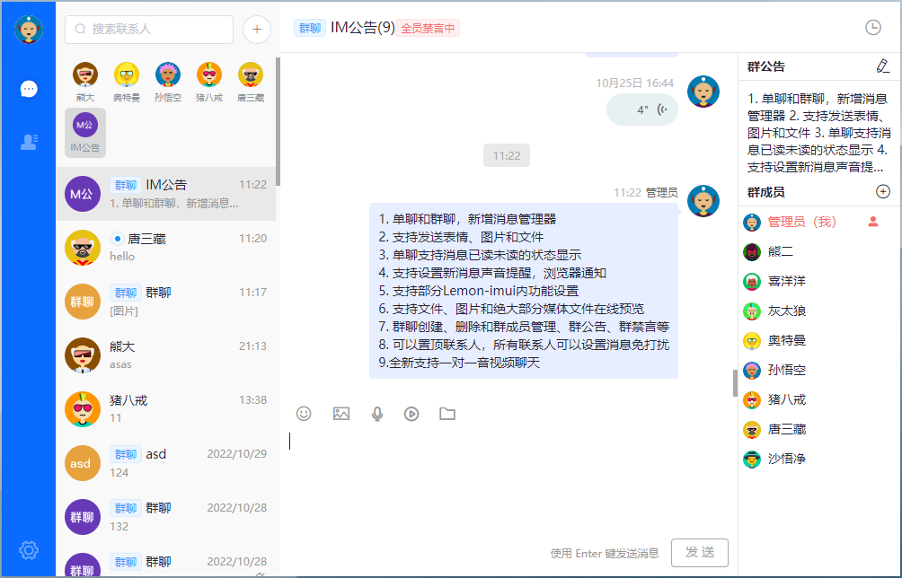

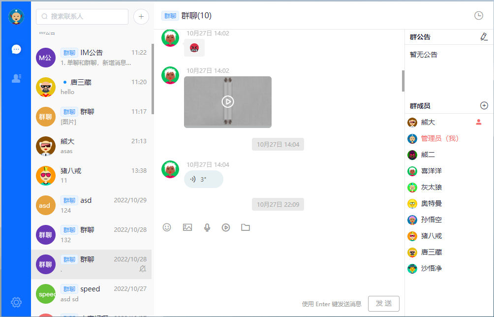

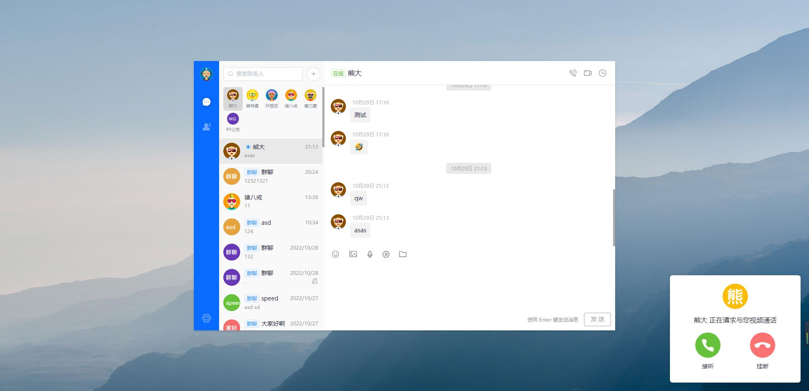

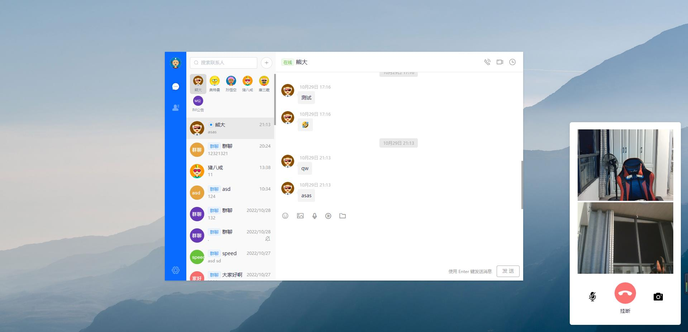

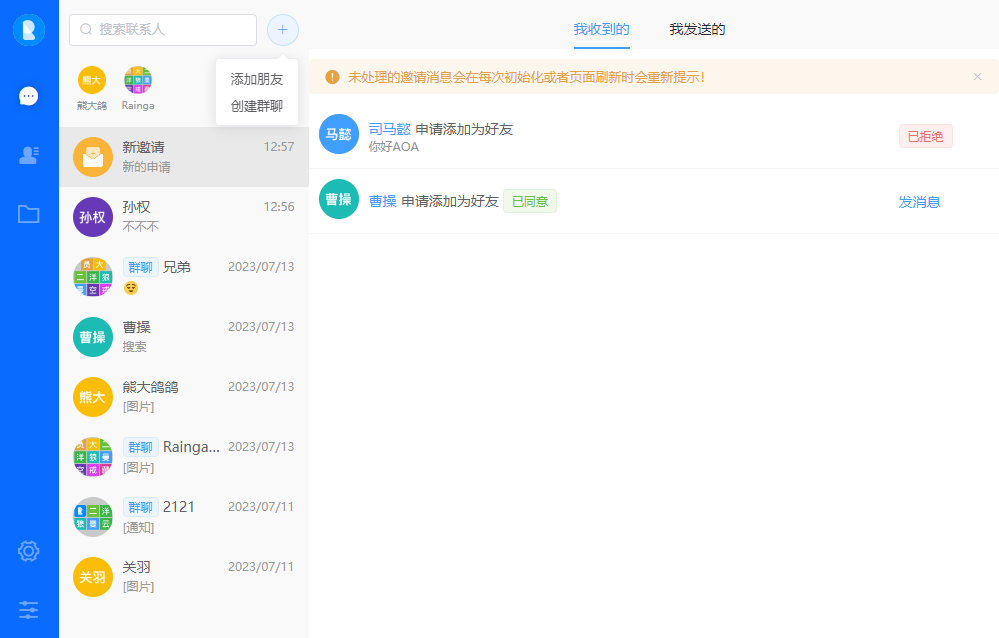

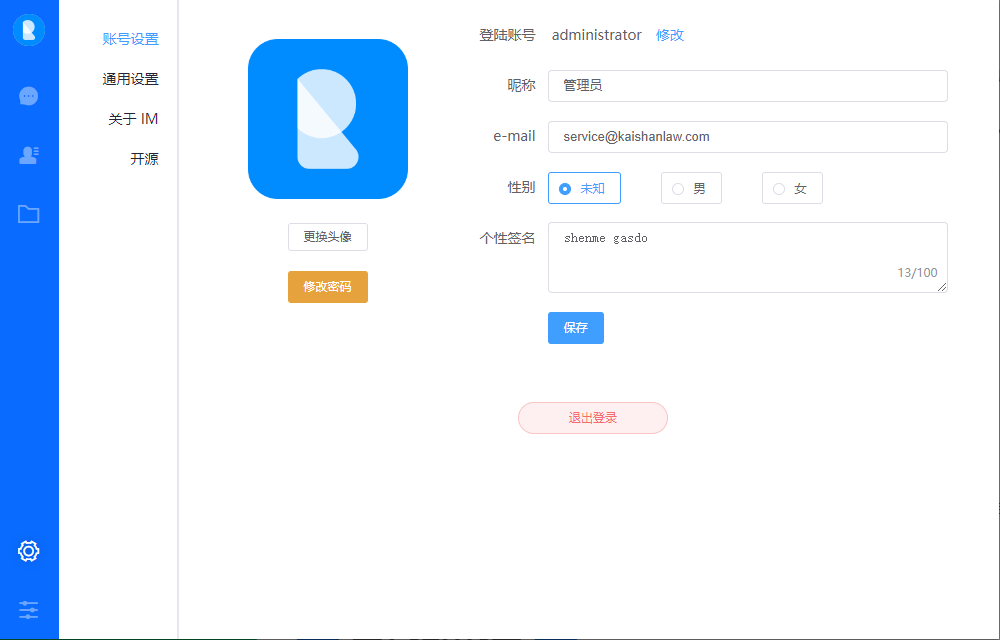

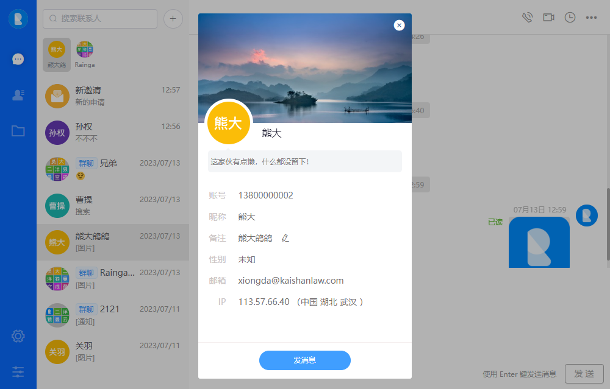

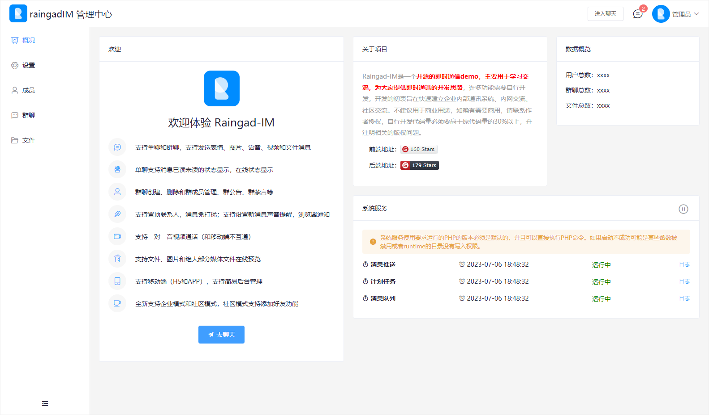

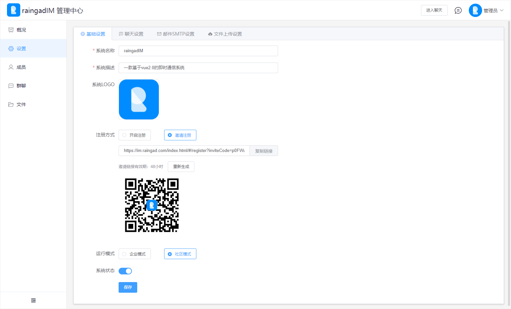

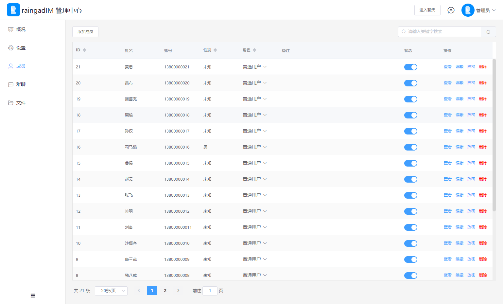

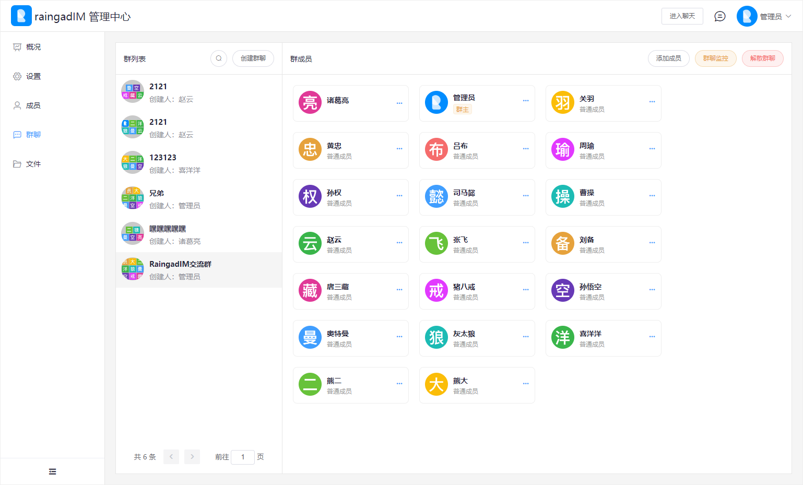

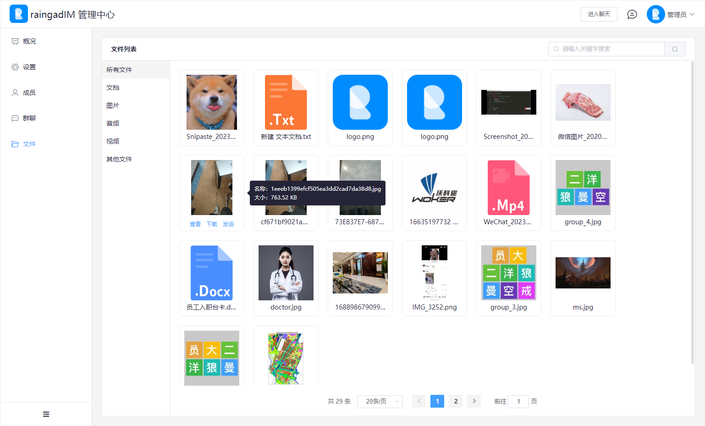

